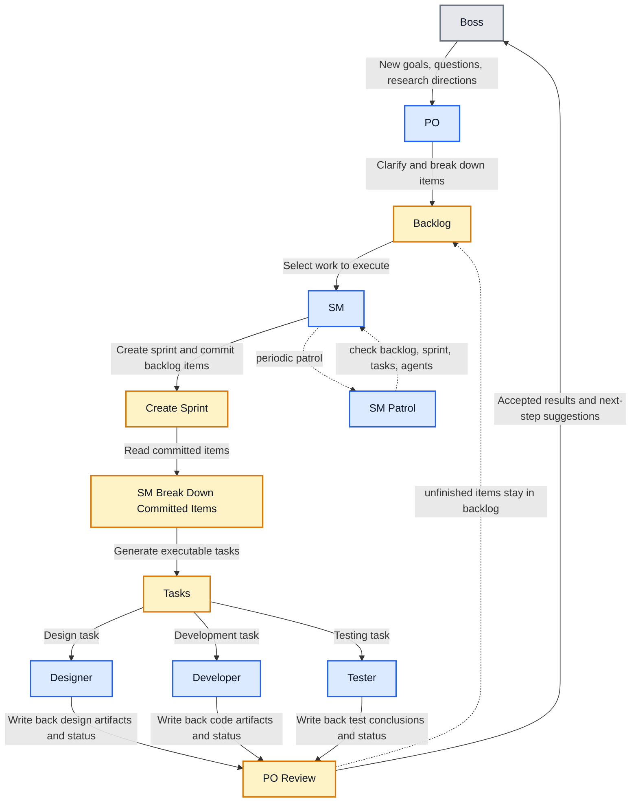

<div align="center">


<p align="center">
  
</p>

<p>
    <a href="https://openclaw.dev"></a>
    <a href="https://nodejs.org"></a>
    <a href="https://nextjs.org"></a>
    <a href="https://www.typescriptlang.org"></a>
</p>

[](https://www.npmjs.com/package/create-agileclawteam)

🌐 Language: **English** | [简体中文](./README_CN.md)

📖 **[For Agent — Machine-readable project reference](./AGENT.md)**

  </div>

# AgileClawTeam

A fully autonomous, self-coordinating multi-agent Scrum team built on OpenClaw for small project development, feature delivery, and research-oriented work.

It does not just let an AI Scrum team run on its own. It also makes the entire collaboration process visible, so you can inspect backlog items, sprints, tasks, agent status, and message flow in real time.

---

## ✨ What It Is

AgileClawTeam maps a small Scrum team into a set of continuously running AI agents: the PO interprets goals and manages backlog items, the SM drives sprint cadence and task orchestration, and the Designer, Developer, and Tester deliver design, code, and validation in parallel.

You only need to give the team a goal. The lobster crew will autonomously handle the following flow:

1. Research the requirement and organize backlog items.
2. Plan a sprint and distribute tasks automatically.
3. Execute design, development, and testing in parallel.
4. Collect artifacts, update state, and push review and retrospective forward.

## 🎯 Good Fit For

- Fast 0-to-1 delivery for small projects
- Autonomous execution of a single feature or a single sprint
- Prototypes, technical validation, and internal tools
- Requirement research, solution comparison, and investigation tasks

## 🔥 Highlights

- Fully automated: from requirement breakdown to sprint execution, review, and retrospective
- Autonomous collaboration: PO, SM, design, development, and testing coordinate by role without constant manual supervision
- Visual dashboard: the dashboard exposes agent status, backlog, sprint, tasks, messages, and connection health in real time
- Cost control: different roles can use different models, so heavy reasoning and lighter execution can be mixed efficiently
- Visible outcomes: you can directly inspect what the team is doing, where it is blocked, and what it has produced
- Easy to extend: role prompts, workflows, and review logic all live in the repository and can be customized directly

---

## ⚡ Quick Start

### 📋 Requirements

- OpenClaw >= 2026.3.12 # lower versions may work but are not tested
- Node.js >= 20
- npm >= 10

### 📦 Get the Project

**Option A — GitHub Template** (one click, no git history)

Click **[Use this template →](https://github.com/ShawnZeng/AgileClawTeam/generate)** on GitHub, clone your new repo locally, then:

```bash
npm install
```

**Option B — npx** (scaffold locally in one command)

```bash
npx create-agileclawteam my-team
cd my-team
npm install
```

### ▶️ Run

```bash
npm run dev
```

Open http://localhost:3000 in your browser. On the first launch, the app automatically opens the setup wizard.

### 🔧 Environment Variables

In the default setup, you do not need to configure Gateway environment variables.

The project connects to OpenClaw using the default address 127.0.0.1:18789, which matches the standard local configuration.

You only need to create .env.local when one of the following is true:

- You changed the OpenClaw Gateway host
- You changed the OpenClaw Gateway port
- You want to explicitly pass OPENCLAW_GATEWAY_TOKEN

Only if you need custom values, run:

```bash
cp .env.local.example .env.local
```

Then fill in your actual address, for example:

```ini
OPENCLAW_GATEWAY_HOST=192.168.1.20
OPENCLAW_GATEWAY_PORT=19000
# OPENCLAW_GATEWAY_TOKEN=your_token_here
```

---

## 🖥️ Dashboard Overview

You can inspect the following directly in the dashboard:

- Whether each agent is online and what it is currently doing
- Real-time changes to backlog, sprint, and tasks
- Message flow and collaboration status across roles
- OpenClaw Gateway connection status and runtime state
- Current artifacts, history, and task progress rhythm

On the first login, the app redirects to the setup check page. You can only continue after the required checks pass. The coding tool setup is optional and not a mandatory prerequisite.

<p align="left">
  
</p>

The main dashboard includes the agent team status, task panels, artifact inspection, conversation history, and other core workspace interactions.

<p align="left">
  
</p>

---

## 🧩 Agent Roles

- **PO**: talks to the boss, clarifies requirements, breaks down backlog items, and accepts outcomes.
  The PO is designed as a strong-confirmation, light-execution entry gate. In [SOUL.md](./openclaw/workspaces/po/SOUL.md) and [AGENTS.md](./openclaw/workspaces/po/AGENTS.md), the PO must first convert the boss request into a title, description, acceptance criteria, and priority, then wait for explicit confirmation before emitting a structured BacklogItem and waking up the SM. [BOOTSTRAP.md](./openclaw/workspaces/po/BOOTSTRAP.md) and [IDENTITY.md](./openclaw/workspaces/po/IDENTITY.md) define startup behavior and role positioning.

- **SM**: plans sprints, orchestrates tasks, drives cadence, and performs state patrol.
  The SM is the team scheduling core. In [SOUL.md](./openclaw/workspaces/sm/SOUL.md), it manages breakdown, dependency coordination, task dispatch, blocker handling, and periodic patrol around tasks.json, sprint.json, and agents.json. [AGENTS.md](./openclaw/workspaces/sm/AGENTS.md) and [BOOTSTRAP.md](./openclaw/workspaces/sm/BOOTSTRAP.md) cover multi-agent collaboration rules and startup recovery. The SM does not talk to the boss directly. It runs the team through process control.

- **Designer**: produces UI proposals, interaction notes, and visual guidance.
  The Designer is a task-driven documentation-oriented executor. In [SOUL.md](./openclaw/workspaces/designer-1/SOUL.md), it receives tasks from the SM, writes design deliverables into workarea/docs/, and publishes formal outputs through artifacts. [BOOTSTRAP.md](./openclaw/workspaces/designer-1/BOOTSTRAP.md) decides whether to resume existing work or stay idle after startup. [IDENTITY.md](./openclaw/workspaces/designer-1/IDENTITY.md), [HEARTBEAT.md](./openclaw/workspaces/designer-1/HEARTBEAT.md), and [USER.md](./openclaw/workspaces/designer-1/USER.md) provide identity, cadence, and user context.

- **Developer**: implements features, fixes issues, and produces delivery-ready code.
  The Developer is a controlled coding executor. In [SOUL.md](./openclaw/workspaces/developer-1/SOUL.md), it is required to work only on assigned tasks, preferably invoking Claude Code or Codex through ACP, generating code inside workarea/src/, and writing status back to the shared state. [BOOTSTRAP.md](./openclaw/workspaces/developer-1/BOOTSTRAP.md) decides whether to resume work or wait after startup. [IDENTITY.md](./openclaw/workspaces/developer-1/IDENTITY.md), [HEARTBEAT.md](./openclaw/workspaces/developer-1/HEARTBEAT.md), and [USER.md](./openclaw/workspaces/developer-1/USER.md) reinforce stable role identity, task rhythm, and working context.

- **Tester**: validates behavior, produces test conclusions, and reports risk.
  The Tester is the downstream quality gate. In [SOUL.md](./openclaw/workspaces/tester-1/SOUL.md), it must wait until dependent tasks are complete, write test reports and defect notes into workarea/tests/, and report issues back to the SM instead of modifying code directly. [BOOTSTRAP.md](./openclaw/workspaces/tester-1/BOOTSTRAP.md) decides whether to continue testing or remain idle after startup. [IDENTITY.md](./openclaw/workspaces/tester-1/IDENTITY.md), [HEARTBEAT.md](./openclaw/workspaces/tester-1/HEARTBEAT.md), and [USER.md](./openclaw/workspaces/tester-1/USER.md) add role identity, working cadence, and user background.

## 🔄 How It Works



The dashboard reads shared state through SSE and WebSocket while connecting to the OpenClaw Gateway, so you can let the team run autonomously and still monitor global progress in real time.

---

## 🗂️ Project Structure

```text
app/           Next.js pages and API routes
components/    Dashboard components and board UI
lib/           State, types, gateway connections, and utilities
openclaw/      Agent configs, workflows, and workspace templates
public/        Static assets
scripts/       Helper scripts
state/         Shared state data
workarea/      Agent working directory for generated outputs
```

## ⚙️ Configuration

If needed, modify the following files to adapt the system to your own workflow. After changing them, you need to re-activate the agents in OpenClaw for the new configuration to take effect: Dashboard -> System Settings -> Re-activate Agent.

- Agent workspace templates live in openclaw/workspaces/
- Workflow definitions live in openclaw/prose/
- Approval and review automation lives in openclaw/lobster/
- Project-level preferences live in openclaw/agile-config.json

---

## 🛣️ Roadmap

Contributions and discussion are welcome. The current project is already a working MVP, but there is still a lot of room to expand:

- Use standard format of documents (For example, from PMP or other project management standards) to ensure project standard and communication between agents.
- Test failure feedback loop: when the Tester finds a problem, feed the result back to the SM automatically and generate or assign follow-up fix tasks
- Stronger quality gates: make test pass, test fail, and re-test-after-rework visible in the dashboard and workflow instead of leaving them only as textual convention
- Multi-team collaboration: support multiple Scrum teams working in the same project, or even across projects, while surfacing separate progress in the dashboard
- Dashboard improvements: add more visualizations such as burn-down charts, task distribution charts, and message flow views
- Dashboard telemetry: token consumption, invocation counts, and similar runtime metrics

---

## 📮 Contact

- X: [@ShawnZeng8](https://x.com/ShawnZeng8)
- GitHub: [ShawnZeng](https://github.com/ShawnZeng)
- Join the WeChat group if you can speak Chinese:

  <p align="left">
    
  </p>

- WeChat Channel：
  <p align="left">
    
  </p>
- Bilibili： [霓季肖恩](https://space.bilibili.com/1178642346)

---

## 📄 License

This project is licensed under the [MIT License](./LICENSE).

Third-party dependencies such as OpenClaw, Next.js, React, and others remain under their respective licenses.
