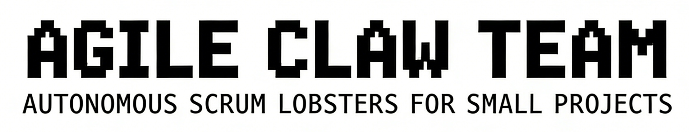
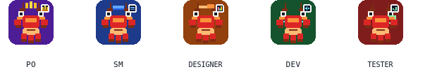
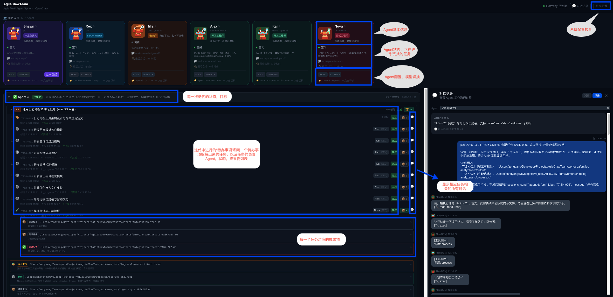
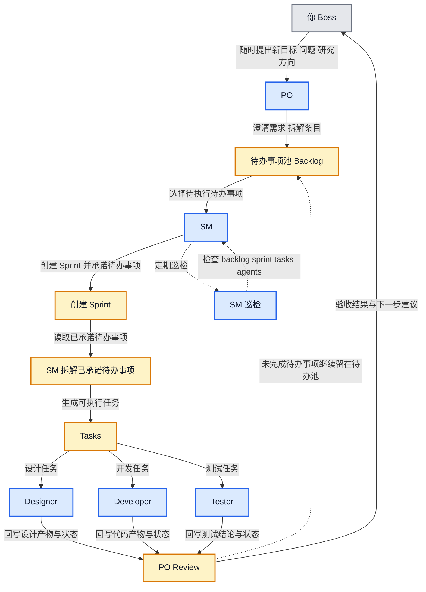
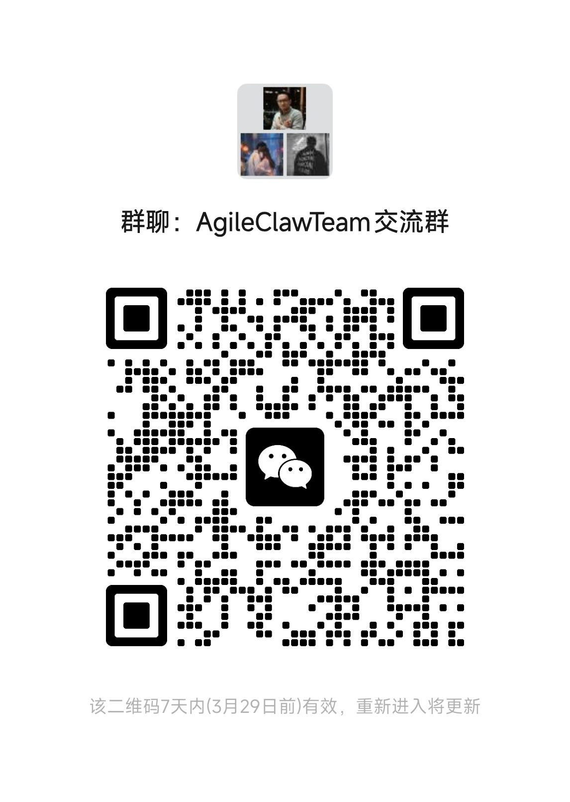

<div align="center">



<p align="center">
  
</p>

<p>
    <a href="https://openclaw.dev"></a>
    <a href="https://nodejs.org"></a>
    <a href="https://nextjs.org"></a>
    <a href="https://www.typescriptlang.org"></a>
</p>

[](https://www.npmjs.com/package/create-agileclawteam)

🌐 语言：**简体中文** | [English](./README.md)

📖 **[For Agent — 机器可读项目参考文档](./AGENT.md)**

</div>

# AgileClawTeam

一个基于 OpenClaw 的全自动、自主协作多 Agent 敏捷团队，面向小型项目开发、功能迭代与调查研究任务。

它不仅能让一支 AI Scrum 团队自主推进工作，还把整个协作过程可视化出来，让你随时看到 Backlog、Sprint、Task、Agent 状态和对话流转。

---

## ✨ 这是什么

AgileClawTeam 把一个小型 Scrum 团队映射成一组可持续运行的 AI Agent：PO 负责理解目标和整理 Backlog，SM 负责 Sprint 节奏与任务派发，Designer、Developer、Tester 并行交付设计、代码和验证结果。

你只需要下达需求目标，龙虾团队们就会自主完成以下流程：

1. 调研需求并整理待办。
2. 自动规划 Sprint 与分发任务。
3. 多角色并行执行设计、开发、测试。
4. 汇总产物、回写状态、推动评审与回顾。

## 🎯 适合什么场景

- 小型项目从 0 到 1 的快速开发
- 单个功能或单个 Sprint 的自主推进
- 产品原型、技术验证、内部工具搭建
- 需求调研、方案比较、调查研究类任务

## 🔥 核心特点

- 全自动：从需求拆解到 Sprint 执行、Review、Retrospective 都可自动推进
- 自主协作：PO、SM、设计、开发、测试角色会按职责自行协同，不需要你逐步盯流程
- 可视化看板：这是项目的一大特点，Dashboard 会实时展示 Agent 状态、Backlog、Sprint、Task、消息与连接状态
- 成本可控：不同角色支持配置不同模型，重推理和轻执行可以混搭
- 结果可见：团队在做什么、卡在什么环节、产出了什么结果，都能直接在界面里看到
- 容易扩展：角色设定、工作流、评审逻辑都在仓库内，可直接修改

---

## ⚡ 快速开始

### 📋 前置要求

- OpenClaw >= 2026.3.12 # 低版本也可能会工作但未经测试
- Node.js >= 20
- npm >= 10

### 📦 获取项目

**方式 A — GitHub Template**（一键创建，无 git 历史）

点击 GitHub 上的 **[Use this template →](https://github.com/ShawnZeng/AgileClawTeam/generate)**，克隆你自己的仓库到本地，然后：

```bash
npm install
```

**方式 B — npx**（一条命令本地初始化）

```bash
npx create-agileclawteam my-team
cd my-team
npm install
```

### ▶️ 启动

```bash
npm run dev
```

浏览器打开 `http://localhost:3000`，首次进入会自动进入 Setup 向导。

### 🔧 环境变量

默认情况下不需要配置 Gateway 环境变量。

项目内默认连接 OpenClaw 的默认地址 `127.0.0.1:18789`，这和系统里的默认配置保持一致。

只有在以下情况时，才需要创建 `.env.local` 并手动配置：

- 你修改过 OpenClaw Gateway 的主机地址
- 你修改过 OpenClaw Gateway 的端口
- 你希望显式传入 `OPENCLAW_GATEWAY_TOKEN`

需要自定义时再执行：

```bash
cp .env.local.example .env.local
```

然后按你的实际地址填写，例如：

```ini
OPENCLAW_GATEWAY_HOST=192.168.1.20
OPENCLAW_GATEWAY_PORT=19000
# OPENCLAW_GATEWAY_TOKEN=your_token_here
```

---

## 🖥️ 可视化看板

你可以直接在 Dashboard 中观察：

- Agent 是否在线、当前在执行什么
- Backlog、Sprint、Task 的实时变化
- 多角色之间的消息流转与协作状态
- OpenClaw Gateway 的连接状态与运行情况
- 当前产物、历史记录与任务推进节奏

首次登录会先跳转到配置检查页，只有在关键检查项通过后才能继续进入系统；其中编程工具配置是可选项，不是必填前置条件。

<p align="left">
  
</p>

主界面功能，包括Agent团队状态、任务面板、成果物检查，对话记录等。

<p align="left">
  
</p>

---

## 🧩 Agent 角色分工

- **PO**：和老板（你）对话，负责需求澄清、Backlog 拆解、结果验收。
  PO 被做成“强确认、弱执行”的需求入口闸门：在 [SOUL.md](./openclaw/workspaces/po/SOUL.md) 和 [AGENTS.md](./openclaw/workspaces/po/AGENTS.md) 里，PO 必须先把老板需求整理成标题、描述、验收标准和优先级，等待明确确认后，才输出结构化 `BacklogItem` 并唤醒 SM；[BOOTSTRAP.md](./openclaw/workspaces/po/BOOTSTRAP.md) 和 [IDENTITY.md](./openclaw/workspaces/po/IDENTITY.md) 则补充了启动方式与角色定位。

- **SM**：负责 Sprint 规划、任务编排、节奏推进、状态巡检。
  SM 是团队调度内核：在 [SOUL.md](./openclaw/workspaces/sm/SOUL.md) 里，它围绕 `tasks.json`、`sprint.json`、`agents.json` 做任务拆解、依赖编排、任务分发、阻塞处理和定期巡检；[AGENTS.md](./openclaw/workspaces/sm/AGENTS.md) 和 [BOOTSTRAP.md](./openclaw/workspaces/sm/BOOTSTRAP.md) 则承接多 Agent 协作协议与启动恢复逻辑。SM 不直接对老板说话，而是通过流程控制整个团队运行。

- **Designer**：产出页面方案、交互说明、视觉建议。
  Designer 是任务驱动的文档型执行者：在 [SOUL.md](./openclaw/workspaces/designer-1/SOUL.md) 中，它接收 SM 的任务后把设计产物沉淀到 `workarea/docs/`，并通过 `artifacts` 回写正式交付物；[BOOTSTRAP.md](./openclaw/workspaces/designer-1/BOOTSTRAP.md) 负责启动后检查现有任务还是进入待机；[IDENTITY.md](./openclaw/workspaces/designer-1/IDENTITY.md)、[HEARTBEAT.md](./openclaw/workspaces/designer-1/HEARTBEAT.md)、[USER.md](./openclaw/workspaces/designer-1/USER.md) 则补充身份、节奏和用户上下文。

- **Developer**：实现功能、修复问题、生成交付代码。
  Developer 是受控的代码执行器：在 [SOUL.md](./openclaw/workspaces/developer-1/SOUL.md) 中，它被要求围绕已分配任务工作，优先通过 ACP 调起 Claude Code 或 Codex，在 `workarea/src/` 中产出代码并回写状态；[BOOTSTRAP.md](./openclaw/workspaces/developer-1/BOOTSTRAP.md) 用来决定启动后是继续任务还是等待；[IDENTITY.md](./openclaw/workspaces/developer-1/IDENTITY.md)、[HEARTBEAT.md](./openclaw/workspaces/developer-1/HEARTBEAT.md)、[USER.md](./openclaw/workspaces/developer-1/USER.md) 则让它保持稳定角色感、任务节奏和上下文记忆。

- **Tester**：验证行为、补充测试结论、反馈风险。
  Tester 是后置质量门：在 [SOUL.md](./openclaw/workspaces/tester-1/SOUL.md) 中，它必须等依赖任务完成后再开始测试，把测试报告和缺陷记录写入 `workarea/tests/`，发现问题后汇报给 SM，而不是直接改代码；[BOOTSTRAP.md](./openclaw/workspaces/tester-1/BOOTSTRAP.md) 负责启动时判断是继续测试还是待机；[IDENTITY.md](./openclaw/workspaces/tester-1/IDENTITY.md)、[HEARTBEAT.md](./openclaw/workspaces/tester-1/HEARTBEAT.md)、[USER.md](./openclaw/workspaces/tester-1/USER.md) 则补充角色身份、工作节奏与用户背景。

## 🔄 工作方式



Dashboard 通过 SSE / WebSocket 读取共享状态文件并连接 OpenClaw Gateway，因此你可以一边让团队自主运行，一边实时观察全局进展。

---

## 🗂️ 项目结构

```text
app/           Next.js 页面与 API
components/    Dashboard 组件与看板
lib/           状态、类型、网关连接等工具
openclaw/      Agent 配置、工作流、工作区模板
public/        静态素材
scripts/       辅助脚本
state/         共享状态数据
workarea/      Agent 实际产物工作区（可在项目中修改成其他地址）
```

## ⚙️ 配置说明

如有必要请自行修改下面的文件以达到特定的需求。配置后需要重新激活Agent到Openclaw中才能生效, Dashboard界面 -> 系统设置 -> 重新激活Agent

- Agent 工作区模板在 `openclaw/workspaces/`
- 工作流定义在 `openclaw/prose/`
- 审批与评审自动化在 `openclaw/lobster/`
- 项目级偏好在 `openclaw/agile-config.json`

---

## 🛣️ 后续计划

欢迎参与讨论和贡献！目前我们已经有了一个可运行的 MVP，但还有很多可以改进和扩展的空间：

- 使用标准化的文档格式（例如来自 PMP 或其他项目管理标准）以确保项目标准化和代理之间的沟通。
- 测试失败回流：当 Tester 发现问题时，后续计划补上从测试结果自动回流到 SM，再重新生成或派发修复任务的闭环流程。
- 更完整的质量门：把“测试通过 / 测试失败 / 返工后复测”明确展示到 Dashboard 和工作流中，而不是只在文字约定中存在。
- 多团队协作：支持多个 Scrum 团队在同一项目中协作，甚至跨项目协作，Dashboard 也能展示不同团队的状态和进展。
- Dashboard 优化：增加更多可视化组件，例如燃尽图、任务分布图、消息流图等，让团队状态一目了然。
- Dashboard 信息增强：token消耗，调用次数等。

---

## 📮 联系方式

- 微信群：扫码加入 AgileClawTeam 交流群，欢迎交流，提建议，想法，友好吐槽。

  <p align="left">
    
  </p>

- 视频号：
  <p align="left">
    
  </p>
- Bilibili： [霓季肖恩](https://space.bilibili.com/1178642346)
- GitHub： [ShawnZeng](https://github.com/ShawnZeng)

---

## 📄 License

This project is licensed under the [MIT License](./LICENSE).

Third-party dependencies such as OpenClaw, Next.js, React, and others remain under their respective licenses.
